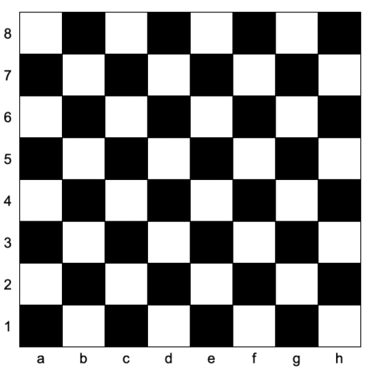

> ## Problem Statement



Above is the standard representation of a chessboard.

This could be imagined as a 2D cartesian plane, with the x axis being represented by the alphabets and y axis by the numbers.

Given coordinates in the form of string, print if that cell is white or black.

> ## Input Format
```
First line contains a string s.
```

> ## Output Format
```
White or Black.
```

> ## Constraints
```
|s|=2
```

> ## Sample Testcase 0

**Testcase Input**
```
b2
```
**Testcase Output**
```
Black
```
**Explanation**

Self explanatory.

---

> ## Sample Testcase 1

**Testcase Input**
```
a1
```
**Testcase Output**
```
Black
```
**Explanation**

We can clearly see a1 is black in the diagram.

---

<details>
<summary><strong>Companies</strong></summary>

`Facebook` `MakeMyTrip` `Citadel` `Hike` `Spotify`

</details>

<details>
<summary><strong>Topics</strong></summary>

`String` `Array`

</details>
