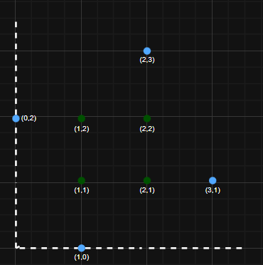
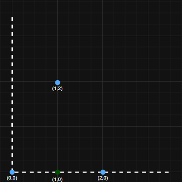

> ## Problem Statement

You own N lakes. Each lake is located on a 2D plane, at a point with integer coordinates. There might be different lakes located at the same point. The mayor of the city is asking you for places for the building of the Art museum.
You have to find the number of places (points with integer coordinates) so that the summary distance from all the lakes to the museum is minimal.
The museum can be built at the same point as some lakes. The distance between two points (x1,y1) and (x2,y2) is |x1−x2|+|y1−y2|, where |x| is the absolute value of x.

> ## Input Format
```
The first line of each test case contains a single integer N, which denotes number of lakes.
Next N lines describe the positions of the houses (xi,yi)
```

> ## Output Format
```
For each test case output a single integer - the number of different positions for the exhibition. The exhibition can be built at the same point as some houses.
```

> ## Constraints
```
1 <= N <= 10^3
0<= xi,yi <=10^6
```


> ## Sample Testcase 0

**Testcase Input**
```
4
1 0
0 2
2 3
3 1
```
**Testcase Output**
```
4
```
**Explanation**

Here are the images for the example test cases. Blue dots stand for the lakes, green — possible positions for the exhibition.




---

> ## Sample Testcase 1

**Testcase Input**
```
3
0 0
2 0
1 2
```
**Testcase Output**
```
1
```
**Explanation**

Here are the images for the example test cases. Blue dots stand for the lakes, green — possible positions for the exhibition.




---


<details>
<summary><strong>Companies</strong></summary>

`Paypal` `Amazon` `Microsoft` `Google`
</details>

<details>
<summary><strong>Topics</strong></summary>

`Binary Search` `Sorting` `Geometry` `Geometry` `Shortest Path` `Matrix`
</details>
