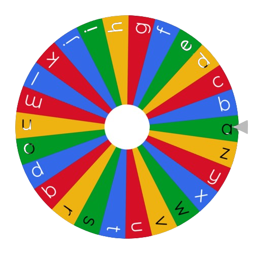

> ## Problem Statement

Ram is playing a game of circular disc in which english alphabets are arranged on a circular disc like in the figure shown below.
In the figure the counter is initially placed on a. A string of letters is given to the ram which he has to first sort. His task is to find the minimum number of seconds in which he can print all the letters of the string.



Each second, Ram may perform one of the following operations:

- Move the pointer one character counterclockwise or clockwise.
- Type the character the pointer is currently on.
Help ram in figuring out the solution

> ## Input Format
```
The first line contains a string S.
```

> ## Output Format
```
The output contains the minimum no of seconds to print the string.

```

> ## Constraints
```
1<=S<10^5
```


> ## Sample Testcase 0

**Testcase Input**
```
bza
```
**Testcase Output**
```
6
```
**Explanation**

The string above will be sorted in abz fashion after which
a gets printed in 1 sec.
 First the cursor will move to b in 1 sec then 1sec for printing it.
In 2sec cursor will reach z and in 1 sec it will get printed.


---

> ## Sample Testcase 1

**Testcase Input**
```
abc
```
**Testcase Output**
```
5
```
**Explanation**

The following characters are printed: - Since the pointer is initially on 'a,' type the character 'a' in 1 second. - In 1 second, move the pointer clockwise to 'b'. - In 1 second, type the letter 'b'. - In 1 second, move the cursor clockwise to the letter 'c'. - In 1 second, type the letter 'c'.

---


<details>
<summary><strong>Companies</strong></summary>

`Coursera` `nvidia` `Juspay`
</details>

<details>
<summary><strong>Topics</strong></summary>

`Sorting` `Strings`

</details>
