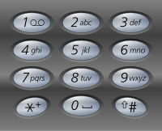

> ## Problem Statement

Vikas saw saurav typing something on his phone and sending a message and deleting it, he wants to know what the message was. But he only remembers the numbers that saurav pressed while typing the keys and not the letters,

Vikas has a classical keypad phone as shown in an image below.




He cannot find out what saurav typed and wants your help in determining all the possibilities of words that could've been typed using the keys on the keypad.

Help him by implementing a code that can output all the possible words that could have been typed given the numbers that were pressed.

Given a string containing digits from 2-9 inclusive,

return all possible letter combinations  in lexicographical (sorted order). that the number could represent.

A mapping of digits to letters (just like on the telephone buttons) is given in above image .

Note that 1 does not map to any letters.


> ## Input Format
```
The first and only line of the input contains string Digits.
```

> ## Output Format
```
Print all possible letter combinations that the number could represent in sorted order,seprated by space 

```

> ## Constraints
```
0 <= digits.length <= 4
digits[i] is a digit in the range ['2', '9'].

```


> ## Sample Testcase 0

**Testcase Input**
```
23
```
**Testcase Output**
```
ad ae af bd be bf cd ce cf
```
**Explanation**

When pressing the button 2 it can give letters: a,b, or c.


Similarly, pressing button 3 can give letters: d,e, or f.


Thus, making all possible combinations we get 9 combinations printed as output.

---

> ## Sample Testcase 1

**Testcase Input**
```
3
```
**Testcase Output**
```
d e f
```
**Explanation**

When pressing button 3 can give letters: d,e, or f.


Thus,we get 3 combinations printed as output.

---


<details>
<summary><strong>Companies</strong></summary>

`VMware` `Flipkart`
</details>

<details>
<summary><strong>Topics</strong></summary>

`Backtracking` `HashTable` `Recursion` `Array`
</details>
