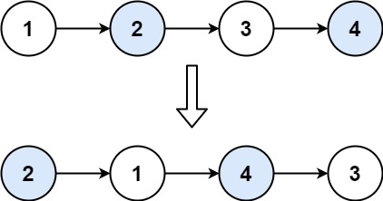

> ## Problem Statement

You are given a linked list with N nodes. You have to write a program that swaps elements of the list pairwise.

You must solve the problem without modifying the values in the list's nodes (i.e., only nodes themselves may be changed.)

 

Example:




> ## Input Format
```
The input is a single line containing N space-separated integers enclosed in square brackets, representing the elements of the linked list.
```

> ## Output Format
```
Linked List with pairwise elements swapped

```

> ## Constraints
```
0 <= Node.val <= 10^2

```


> ## Sample Testcase 0

**Testcase Input**
```
[1,2,3,4]
```
**Testcase Output**
```
[2, 1, 4, 3]
```
**Explanation**

We have swapped the first two nodes with values 1 and 2, and the last two nodes with values 3 and 4.

---

> ## Sample Testcase 1

**Testcase Input**
```
[1]
```
**Testcase Output**
```
[1]
```
**Explanation**

Since no pair are formed of single element. the position remanin unchanged

---


<details>
<summary><strong>Companies</strong></summary>

`ServiceNow` `Paypal` `Microsoft`
</details>

<details>
<summary><strong>Topics</strong></summary>

`Iterator` `Recursion` `Two Pointers` `Linked List`

</details>
