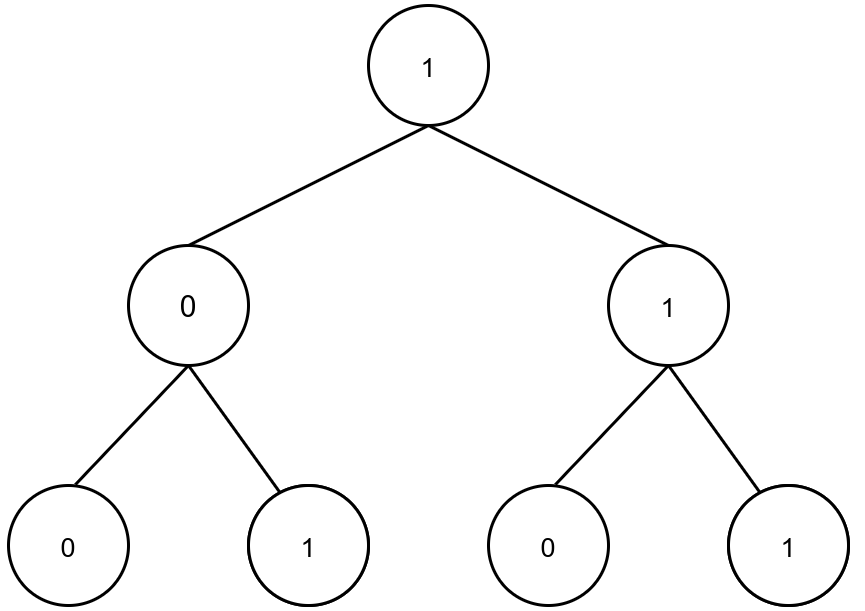

> ## Problem Statement

Yash is given a perfect binary tree of N nodes, with 0 or 1 as the value of each node. Starting with the most significant bit, each root-to-leaf path represents a binary number.

For example, if the path is 0 -> 1 -> 1 -> 0 -> 1, this may be 01101 in binary, which is 13.

Consider the numbers represented by the path from the root to each of the tree's leaves. Rohit needs to calculate the total of these numbers generated for all root-to-leaf paths. The test cases are created in such a way that the solution can be stored in a 32-bit integer.

Note: A perfect binary tree is a binary tree in which all interior nodes have two children and all leaves have the same depth or same level, so there will be no "null" value in level order sequence of the input array.


> ## Input Format
```
The first line of the input contains an integer n, denoting the nodes in the perfect binary tree.

The second line contains n space-separated integers representing the level order of perfect binary tree.
```

> ## Output Format
```
Print the sum of these numbers generated from all root to leaf paths.

```

> ## Constraints
```
0 < N < 10^3

```


> ## Sample Testcase 0

**Testcase Input**
```
1
0 
```
**Testcase Output**
```
0
```
**Explanation**

There is one node 0. The only number formed is 0 so we print 0.

---

> ## Sample Testcase 1

**Testcase Input**
```
7
1 0 1 0 1 0 1 
```
**Testcase Output**
```
22
```
**Explanation**



The four path are:

1) [1, 0, 0] -> 100 = 4
2) [1, 0, 1] -> 100 = 5
3) [1, 1, 0] -> 100 = 6
4) [1, 1, 1] -> 100 = 7

Therefore, the total sum is  4 + 5 + 6 + 7 = 22

---


<details>
<summary><strong>Companies</strong></summary>

`Amazon` `Google` `Microsoft` `Adobe`
</details>

<details>
<summary><strong>Topics</strong></summary>

`DFS` `BFS` `Binary Tree` `Recursion` `Backtracking`
</details>
