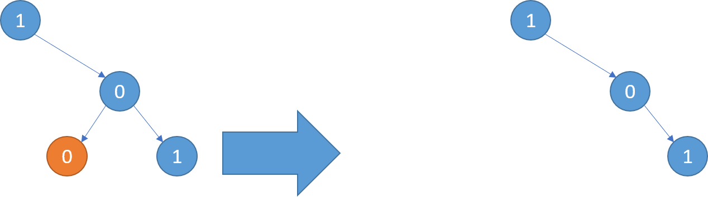
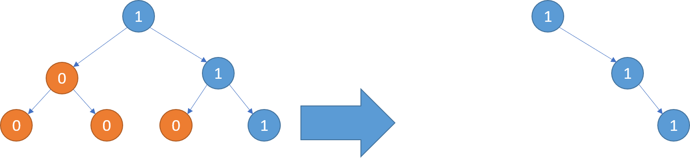
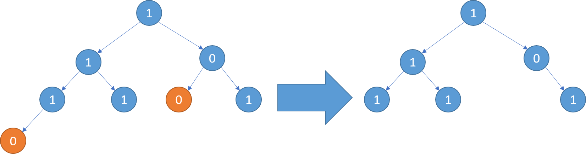

> ## Problem Statement

You are given the root of a binary tree where every node's value is either a 0 or a 1.

You need to delete some of the nodes of the binary tree such that there exists no subtree which does not have a node with value 1 in it.

Note- N is the number of nodes in the tree and Node's value is either 0 or 1

Example 1:




Example 2:




Example 3:




> ## Input Format
```
The input consists of a single line representing the level order serialization of a binary tree.
```

> ## Output Format
```
Print a single line representing the level order serialization of the pruned binary tree.

```

> ## Constraints
```
1 ≤ N ≤ 2*10^2

```


> ## Sample Testcase 0

**Testcase Input**
```
[1,0,0,0,0,1,1]
```
**Testcase Output**
```
[1, null, 0, 1, 1, null, null, null, null]
```
**Explanation**

Prune left subtree:Nodes 0 with children 0 and 0 are removed as they do not contain 1.
Result: null for the left child of the root.


Prune right subtree:Nodes 1 and 1 are kept.
Both have no further children.
```text
    1
     \
      0
     / \
    1   1
```


Root 1, no left child (null), right child 0.
Right child 0 has children 1 and 1, both with no further children (null).


---

> ## Sample Testcase 1

**Testcase Input**
```
[1,1,0,0,0,1,0,0,0,0,0,0]
```
**Testcase Output**
```
[1, 1, 0, null, null, 1, null, null, null]
```
**Explanation**

The root node is 1, which is kept.
The left child of the root is 1, which is kept.
The right child of the root is 0, but it has no subtree with 1, so it is kept as per the problem constraints.
The left child of the left child of the root is 0, but it is kept as it has no further 1 subtrees to prune.
The right child of the left child of the root is 0, but it is kept as it has no further 1 subtrees to prune.
The 1 at the rightmost level has no children, so its subtrees are represented by null.

---


<details>
<summary><strong>Companies</strong></summary>

`Intuit` `Microsoft` `Morgan Stanley` `Paypal` `jp morgan`
</details>

<details>
<summary><strong>Topics</strong></summary>

`Tree Traversal` `Binary Tree`
</details>
