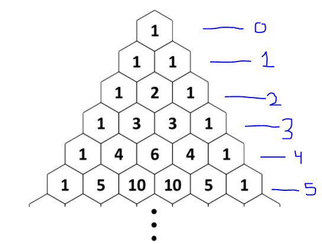

> ## Problem Statement

You are given a triangle shape figure as shown in the figure. You have to decode the pattern in each row and find all the numbers in the nth row. (indexing starts from 0)



> ## Input Format
```
Only one  line contains an integer denoting the value of n.
```

> ## Output Format
```
It contains several (one or more) space-separated integers denoting all the elements of the ith row from left to right.
```

> ## Constraints
```
0<=n<=33
```


> ## Sample Testcase 0

**Testcase Input**
```
3
```
**Testcase Output**
```
1 3 3 1
```
**Explanation**

From the pattern it is clear that the 3rd row elements are 1,3,3,1

---


> ## Sample Testcase 1

**Testcase Input**
```
4
```
**Testcase Output**
```
1 4 6 4 1
```
**Explanation**

From the pattern it is clear that the 4th row elements are 1,4,6,4,1 (indexing starts from 0).

---


<details>
<summary><strong>Companies</strong></summary>

`Wipro`
</details>

<details>
<summary><strong>Topics</strong></summary>

`Patterns` `Combinatorics` `Iterations` `mathematics`

</details>
