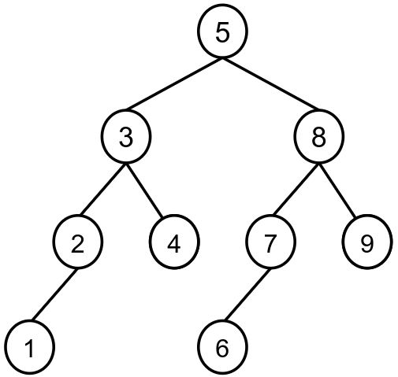
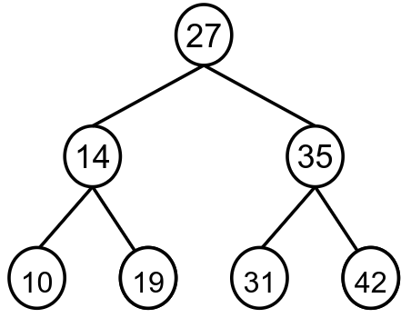

> ## Problem Statement

Rahul has an integer array called 'arr' of length N containing unique values. He wants to create a balanced tree where each parent node has smaller valued nodes on its left and larger valued nodes on its right. This balanced tree should ensure that the depth of the two subtrees for every node doesn't differ by more than one.

Your task is to assist him in creating this type of tree.

The output contains N lines denoting the pre-order traversal of nodes. If the left child of the node contains not null value then print the value else print a dot(.) , a similar process for the right child also. Each right child value is separated from the node by “->” sign and each left child by a left arrow sign

> ## Input Format
```
First line contains an integer N representing the size of the array arr

The second line contains N unique space-separated integers representing the elements of the array arr
```

> ## Output Format
```
The output contains N lines denoting the pre-order traversal of nodes. If the left child of the node contains not null value then print the value else print a dot(.) , a similar process for the right child also. Each right child value is separated from the node by “->” sign and each left child by a left arrow sign
```

> ## Constraints
```
1<= N <= 10^5

1 <= arr[i] <= 10^9
```


> ## Sample Testcase 0

**Testcase Input**
```
9
1 3 2 4 5 7 6 8 9
```
**Testcase Output**
```
3 <- 5 -> 8
2 <- 3 -> 4
1 <- 2 -> .
. <- 1 -> .
. <- 4 -> .
7 <- 8 -> 9
6 <- 7 -> .
. <- 6 -> .
. <- 9 -> .
```
**Explanation**

The tree formaed will be: 



Clearly this is the height balanced tree which is formed by traversing the given array, such that all the left nodes are less than the parent node and all the right nodes are greater than the parent node.

---


> ## Sample Testcase 1

**Testcase Input**
```
7
10 31 42 19 27 35 14
```
**Testcase Output**
```
14 <- 27 -> 35
10 <- 14 -> 19
. <- 10 -> .
. <- 19 -> .
31 <- 35 -> 42
. <- 31 -> .
. <- 42 -> .
```
**Explanation**

The tree formed will be



This is the height balanced tree which can be formed using the given array such that all the left nodes are less than the parent node and all the right nodes are of greater value than the parent node.

---


<details>
<summary><strong>Companies</strong></summary>

`TCS` `Accenture` `Citadel` `Yelp` `eBay`
</details>

<details>
<summary><strong>Topics</strong></summary>

`Tree` `Divide and Conquer` `Binary Search Tree` `Recursion` `Preorder` `Sorting` `Binary Search` `Array`
</details>
